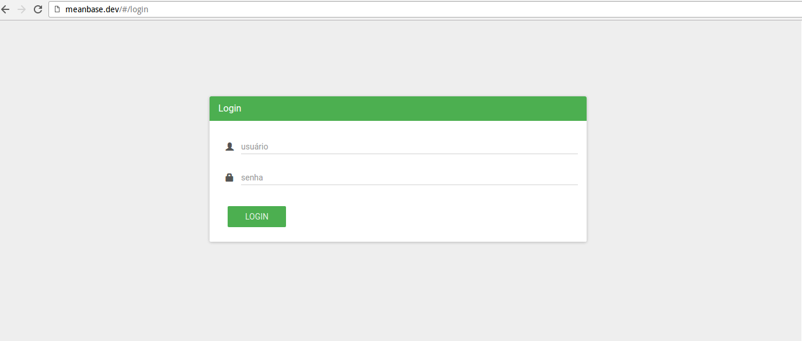

### Estrutura básica para criar um sistema com MEAN modular, login já incluído.
sudo nginx-manager -d /var/www/projetos/meanbase/frontend/ -u meanbasenginx.dev -n meanbasenginx -p 10


---
### Requer devidamente instalado

* Apache2
    * sudo apt-get install libapache2-mod-proxy-html libxml2-dev
* MongoDB
* NodeJS

---

* na pasta **docs** contém o template padrão para criar o vhost no apache usando o [vhost-manager](https://github.com/rubensfernandes/vhost-manager)

```javascript
\backend
	\app //contém a aplicação em NodeJS
\docs
\frontend
	\app //contém a aplicação em AngularJS
	\dist
```


* Na pasta **frontend**

```
bower install
npm install
```

* Agora vamos criar uma Url para acessar seu projeto pelo navegador, dentro da pasta docs temos o arquivo template.conf, ele serve para criar um virtual host no apache, se você usa outro servidor tem que configurar uma rota de proxy para a porta que vai usar no backend, altere apenas a porta no template.

```xml
<VirtualHost *:80>
    ServerName template.url
    ServerAlias template.url

    DocumentRoot template.webroot

	ProxyRequests on
	ProxyPass /api http://localhost:4040
</VirtualHost>
```

* Na pasta **docs**

```
sudo vhost -d /var/www/pasta_raiz/frontend -url projeto.dev -t template.conf nome_do_projeto
```

> Se for na **PRODUÇÃO** rode na pasta **frontend**

```
grunt
```
> e no vhost configure o **-d** para ser a pasta **dist** dentro da pasta frontend ficando assim

```
sudo vhost -d /var/www/pasta_raiz/frontend/dist -url projeto.com.br -t template.conf nome_do_projeto

```

* Na pasta **frontend** duplique o arquivo **config.js.dist** para **config.js** e edite conforme configurou sua url do projeto

```javascript
(function () {
    'use strict';

    angular.module('app')
        .constant('myConfig', {
            api: 'http://projeto.dev/api',
        });

    angular.module('core')
        .constant('coreConfig', {
            cache: true,
        });
})();

```


> se tudo foi configurado certo acesse: projeto.dev e você verá uma tela de login parecida com essa:




## Ok agora vamos configurar o **backend** :rocket:

* na pasta backend

```
npm install
```

* novamente duplique o arquivo **config.js.dist** para **config.js**

```javascript
module.exports = {
    secret: 'token_aleatorio_para_o_jwt',
    database: 'mongodb://127.0.0.1:27017/meanbase',
    uploadPath: '/var/www/projeto/frontend/uploads/',
    port: 4040,
 	passFixture: 'senha_para_fixture',
};

```

> atenção na **port** tem que ser a mesma que se encontra no **template.conf** dentro da pasta **docs**

* dentro da pasta **backend**, iniciamos nosso servidor

```
node index.js
```

> se tudo foi configurado corretamente irá aparecer algo como
```
Server start: 4040
```

## Agora vamos criar o usuário admin para logar no sistema

* pelo navegador acesse: projeto.dev/api/fixture/usuario/senha_para_fixture

> **senha_para_fixture** é configurada no arquivo de config.js do backend

---

:airplane: Pronto agora você pode acessar a url do projeto e logar com o usuário: **admin** e a senha: **admin** :airplane:
